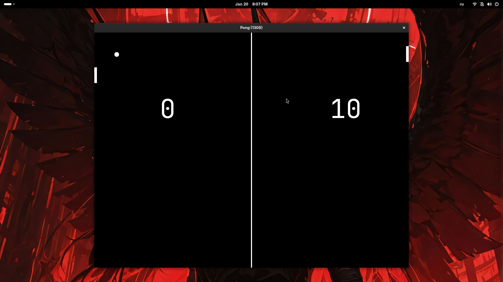

# Pong  
*Simple C++/SDL3 implementation of classic Pong with an unbeatable bot.*

> 

---

## Overview

- Написан на **C++** с использованием **SDL3** и **SDL3_ttf**.  
- Режим: игрок против идеального бота (его ракетка всегда следует за мячом).

## Features

- Классический Pong: мяч, две ракетки, счёт.
- "Нечестный" бот: ракетка бота всегда на уровне мяча по оси Y.  
- Отрисовка текста через SDL3_ttf.

## Controls

| Клавиша | Действие |
|---------|----------|
| **W**   | Левая ракетка вверх |
| **S**   | Левая ракетка вниз |
| **O**   | Правая ракетка вверх (если режим Two Players |
| **L**   | Правая ракетка вниз (если режим Two Players |
---------------------------------------------------------

## Building

**Требования:**
- C++17+
- SDL3, SDL3_ttf

```bash
git clone https://github.com/mental0-main/pong.git
cd pong
mkdir build && cd build
cmake .. && make -j3
cp ../assets/fonts/monojet.ttf .
./pong
```

